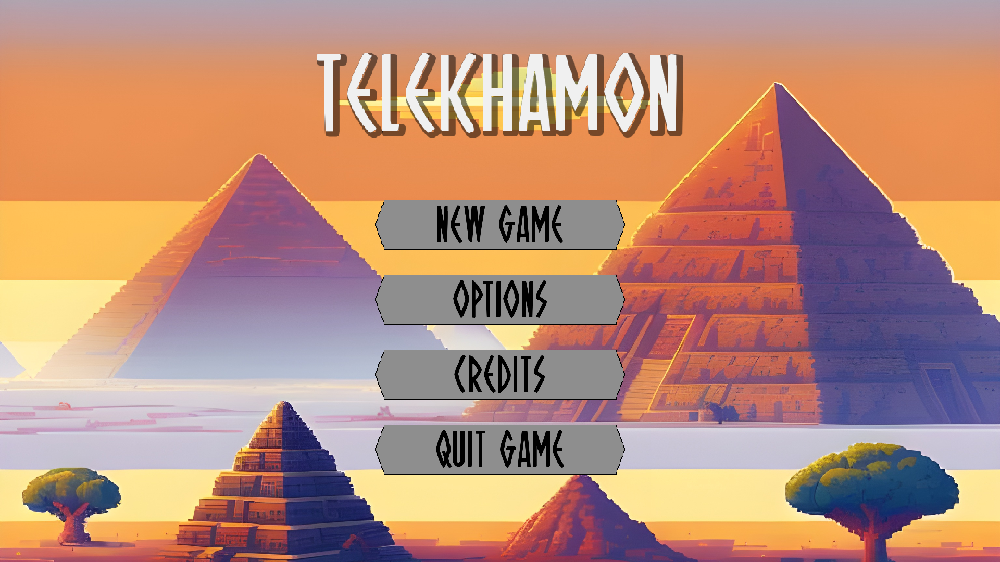
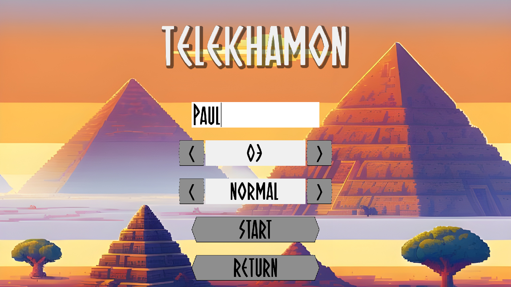
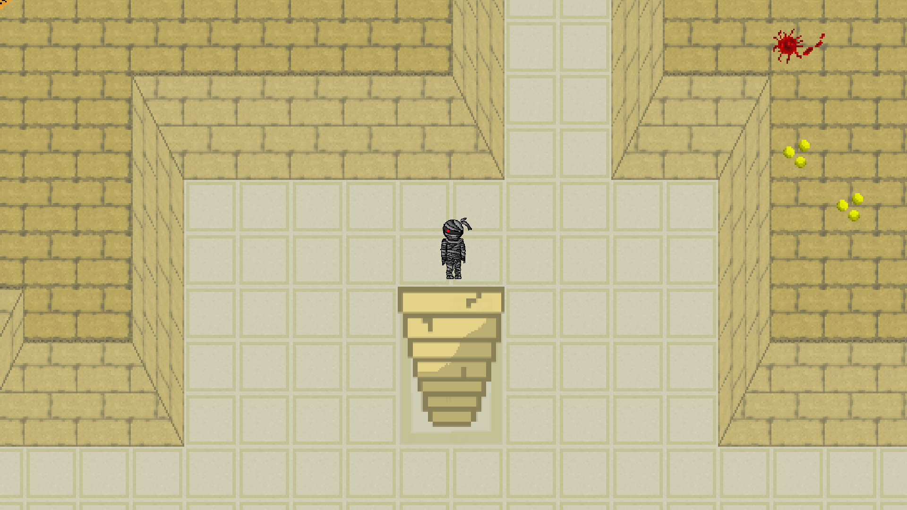
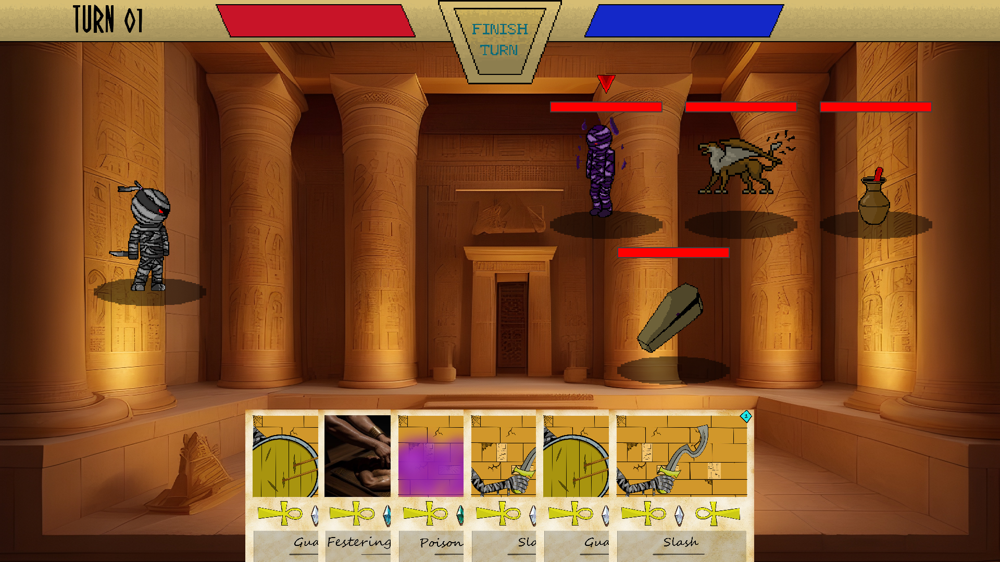
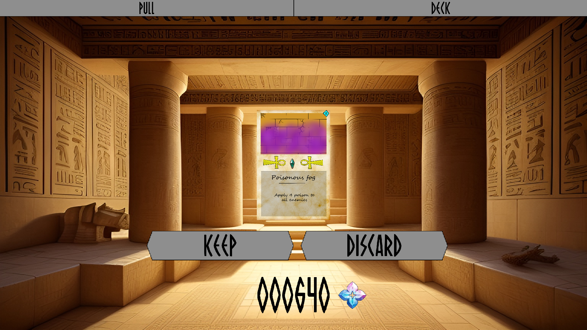
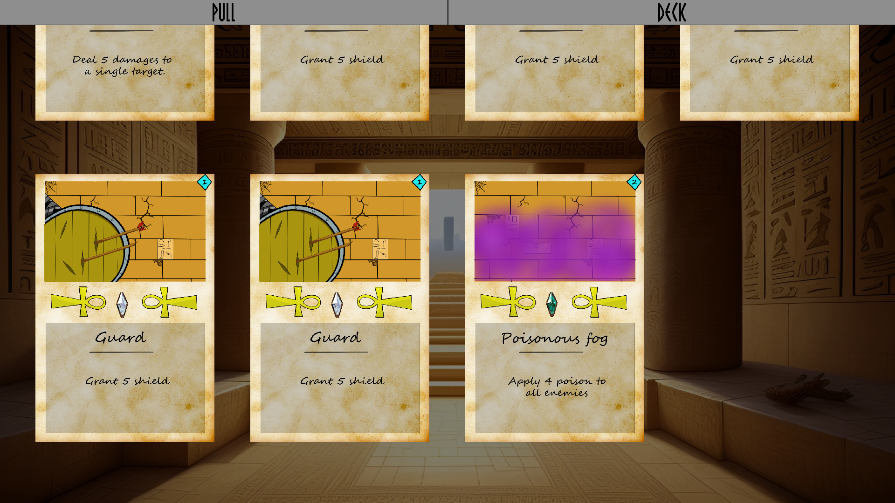
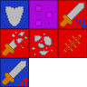
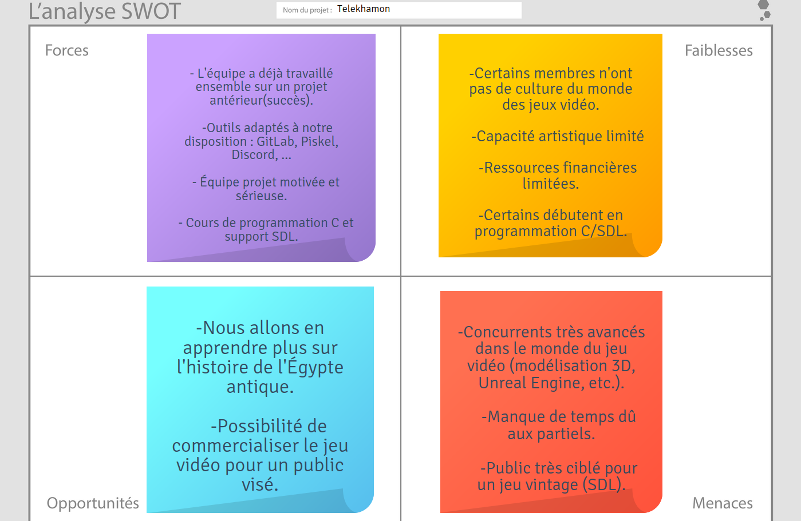
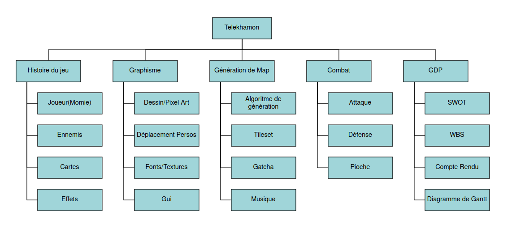

# TELEKHAMON



Please ensure that you have the following packages installed on your system :
```
clang libsdl2-dev libsdl2-image-dev libsdl2-mixer-dev libsdl2-ttf-dev libsqlite3-dev
```
To compile this project, use :
```
make
```
To run this project, use :
```
make run
```

## Summary

* [Documentation](#documentation)
    * [Game Description](#game-description)
    * [Tutorial](#tutorial)
* [Work Repartition](#work-repartition)
    * [Eliott](#eliott)
    * [Alexandre](#alexandre)
    * [Adrien](#adrien)
    * [Lucie](#lucie)
    * [Louis](#louis)
* [Technical Details](#technical-details)
    * [Terrain Generation](#terrain-generation)
    * [A*](#a)
    * [Mobs AI](#mobs-ai)
    * [Fighting System](#fighting system)
    * [Utils](#utils)
        * [List](#list)
        * [Stack](#stack)
        * [PriorityQueue](#priorityqueue)
* [Project Managment](#project-managment)
    * [SWOT](#swot)
    * [WBS](#wbs)
    * [Meeting Reports](#meeting-reports)

## Documentation

### Game Description

Telekhamon is a rogue-like deckbuilder that includes elements of gatcha. The player embodies a mummy who moves from floor to floor within a pyramid filled with enemies. As he progresses, the player must face various enemies in combat, fighting with the aid of cards. Each victory earns money, which can be used to purchase cards randomly selected from over 20 different types. To win the game, the player must defeat the boss on each floor to escape the pyramid.

### Tutorial

The controls are as follows:

| Key | Description |
|--------|-------------|
| Z or Up | Moves upwards |
| Q or Left | Moves left |
| S or Down | Moves downward |
| D or Right | Moves to the right |
| Tab | In-game, opens deck and gatcha interface. |
| Escape | In game, opens pause menu. |
| F11 | Enable/Disable full screen |
| Left-click | Most likely to click on graphical interface elements!

The first step, once the game is launched and the intro is over, is to create a new run:



You can choose between 3 difficulty levels, and has a number of pyramid floors between 2 and 5. Once the player's name has been entered and the start button pressed, the game begins.



To progress through the pyramid, you need to find the staircase that takes you down to the next floor. You may encounter enemies as you move through the pyramid's corridors. Be careful: if they spot you, they'll try to catch you. There's also a fight with the floor boss as soon as you try to use the staircase.

When you enter combat, the following interface opens :



The top bar shows :
* The current turn number
* The player's HP (Health Points) bar, in red
* The button to end your turn
* The player's EP (Energy Points) bar, in blue (regenerate by 3pts per turn)

On the left, that's you. On the right, the enemies you face. There are between 3 and 5 per battle. You can aim at an enemy by clicking on it: an arrow indicates the enemy you are currently aiming at. 

Finally, at the bottom are the cards in your hand. A battle starts with 6 cards in your hand - each card requires a certain amount of EP to play (top right of the card), and you can play as many cards as you like during your turn, as long as you have enough EP. At the start of each turn, you draw 4 cards from your deck and regenerate 3 EP.

If your HP drops to zero, you lose the run and return to the main menu. If you win the fight, you get a certain amount of money, which you can use to buy cards.



Each card costs 160 to obtain. These are randomly selected at the time of purchase according to their rarity. You can choose to keep or discard a purchased card. Please note! A kept card cannot be removed from your deck, so choose carefully which cards you want to keep.

In Easy mode, you start with the cash equivalent of 10 cards.

In Normal mode, you start with the cash equivalent of 5 cards.



You can also view the cards you've chosen to keep, so you can see how you've built your deck and determine how you want it to evolve.



There are 7 different effects that can be applied to the player as well as to enemies to make combat more interesting.

### Shield :

This effect reduces damage (1 shield cancels 1 damage) and is consumed each time it is used, and reset to 0 at the end of the entity's turn (player or opponent).

### Poison :

This effect causes damage (1 damage for 1 poison) at the end of each entity's turn, and each time it is applied the cumulative effect is divided by 2. The shield is not affected by poison damage.

### Weakness :

This effect reduces direct damage (everything except poison) inflicted by entities on other entities by 33%, with the number of accumulations reduced by 1 at the end of each turn (accumulations only apply 1 time).

### Weak :

This effect reduces the damage inflicted by one entity on another by 1. The number of accumulations is reduced by 1 at the end of the turn.

### Brittle :

This effect increases the direct damage suffered by entities by 33%, and the number of accumulations is reduced by 1 at the end of the turn.

### Wounded :

This effect increases the direct damage suffered by entities by 1. The number of accumulations is reduced by 1 each time the effect is applied.

### Strength :

This effect increases the damage inflicted by entities by 1. The number of accumulations is reduced by 1 at the end of the turn.

### Conclusion :

The formula that gives the direct damage inflicted by an entity (C) on a target (T) is therefore :

```math
damage = (damage_{base} + strength_C - weakness_C) \times \\ (1 - 0,33 \times max(1,weak_C)) \times \\(1 + 0,33 \times max(1,brittle_T)) + wounded_T
```

[back to top](#summary)

## Work Repartition

### Eliott

**Algorithms :** None.

**Libraries :** sqlite3 : access to enemy data, enemy skills and card data.

**How it Works:**

I mainly worked on the Fighting System's functioning, so I mostly created my own structures to represent enemies and their skills, as well as the player and the cards he can use.
Then I created functions to link all these structures to the player's interaction, in order to achieve a functional Fighting System.
The part I found the most complicated is that the number of variables to be managed in each structure is quite high (mainly a lot of effects to manage), which can result in functions that are not very aesthetic and difficult to read.

**Softwares autres :** Clip Studio Paint, Piskel.

I used these programs to create certain textures (Clip Studio Paint for the hand-drawn parts of the cards, and Piskel for the tilesets, icons and animations).

[back to top](#summary)

### Alexandre

**Algorithms :** Procedural generation of pyramid floors, algo for deciding enemy skills.

**Libraries :** SDL, math, stdio, stdlib, time, float, assert, string.

**How it Works :**

Half of my work focused on the procedural generation of the pyramid's floors. I took inspiration from an algorithm I'd seen online to start my algorithm (generate X “random” sized pieces at small, random coordinates, then space them from the center until there are no more collisions between them). Then I adapted without Unity; to put it simply, I determined, for each part, the parts with which it should be linked, then I created the paths between all these pairs of parts, and finally I displayed small randomly generated parts between the large linked parts. All I had to do was put the whole thing in a while loop until the generated map was connected, determine the stairs for the spawn and the exit, and I was done.
The rest of the time, I worked on the game's music and sound effects, took care of a few things to modify in the code, and wrote the enemies' combat decision functions (“ia”: The enemies all have three different attacks, and when it's their turn to attack, they assign each one a score according to the parameters of the current combat, and use, without creating too repetitive patterns, the best of the three they can).
It was a very interesting project, which enabled me to discover the true value of programming in the C language, to make up for my shortcomings in git and to learn how to really use it in a group project.

**Softwares :** Ableton Live 12 Trial, Audacity, Piskel, perchance.org (Card image generation).

[back to top](#summary)

### Adrien

**Algorithms :** None

**How it Works :**

Part of my job was to manage the character's movements and collisions with the environment. I also had to generate random enemies on the map, and define the mummy's initial position.
Most of the time was spent on the visual part of the game, drawing sprites and animations for the mummy and the enemies, making sure that each entity had an idle animation as well as an attack and hit animation. (I hope I never have to do move animations again in my life).

**Softwares :** Piskel (my beloved).

[back to top](#summary)

### Lucie

**Algorithme :** A*

**A\* :**

This is an algorithm for finding the shortest path between 2 entities at different locations. Proposed in 1968, it is actually an extension of Dijkstra's algorithm. The main difference between the two algorithms is the use of a heuristic for A* to guide the search. 
The heuristic chosen here is the Manhattan distance (the same distance as the cab that travels the streets of Manhattan). 

**Cards an effects :**

I've created a variety of structures and functions for the player, cards and effects. This includes functions for attacking enemies depending on the target (everyone, a single enemy, the player or all enemies). I ran into difficulties implementing the enemy structure and attack functions, which I felt were too comprehensive, so my dear colleague Elliot took over the Fighting System.

**My Work :**

I took part in setting up the Fighting System and implementing the A* algorithm, enabling enemies to track the player in the overworld.

**Softwares :** 
sprites (piskel), Project Managment (Latex).

**Conclusion :**

Thanks to this project, I was able to develop my C language skills and discover a little more about the world of video games, particularly thanks to my fellow students, who took the time to explain certain concepts and definitions that I didn't know.

[back to top](#summary)

### Louis

**Algorithms :** None

Of all the members of the group, I probably spent the least time creating resources for the game, and the most time coding. My job was to create all the code for the graphics of the project. More broadly, I created all the display functions and related structures, as well as all the graphical interfaces. These parts of the code don't require the use of complex algorithms, but they are heavy and require the manipulation of numerous data structures from throughout the project in order to render them correctly. The structure I've manipulated the most is undoubtedly SDL_Rect, for displaying a texture on an area of the screen.

To give just a few examples of what I've done, we can mention the Button structure, which displays a clickable button that executes a function passed as a parameter, various text rendering functions that create a texture from a string of characters (for example, it's possible to choose the color of certain sections of the text using text formatting that I've introduced), the Transition structure, which allows you to move any object from state A to state B (this allows you to move cards automatically, varying their speed and alpha along the way, for example), and a few data structures such as List, Stack or PriorityQueue, which are used elsewhere in the code. I'm also quite proud of the Star Wars-style introduction to the game. Simulating a 3D rendering in 2D wasn't easy: rendering a texture on a trapezoid causes visual distortions that I had to correct by cutting the trapezoid into numerous small sections closer to a square when rendering. 

Finally, I spent a considerable amount of time correcting various bugs, memory leaks and helping my fellow students debug their code. Indeed, having 6 years' experience in C++, I'm very good at reading, writing and understanding C, which saves time when fixing bugs.

**Softwares :** VSCode, gdb and Valgrind.

[back to top](#summary)

## Technical Details

### Terrain Generation

1. Generate random rooms: Large rooms, smaller rooms (hidden at first), large hidden rooms, and small hidden rooms.
2. Randomly assign each of them a floating polar position (corresponding to the middle of the room) in a circle of radius 1 and center O, so that the rooms overlap.
3. Sort rooms by increasing distance from the center in an array.

4. We then place each room (i.e. give it fixed Cartesian coordinates). For each room in this list :
    a. As long as this room collides with another that is placed :
    b. Move it by a radius dr from the center. *Initially dr was supposed to be small (< 0.5), but then rooms were too often stuck together for my taste, so it now takes on a larger value (~15), so that large rooms are (in almost all cases) separated by at least one tile.* The room no longer touches others already placed, so we move it by a radius of dr from the middle.
    
    The room no longer touches the others already placed, so we place it in turn.
    c. Find the room's floating Cartesian coordinates.
    d. Assign integer Cartesian coordinates to the room, so that it doesn't collide with any others.

5. Create a second room list containing only large rooms.
6. For each large room :
    a. Arrange in a list the polar coordinates (relative to the reference frame centered on this room) of the 7 large rooms closest to this room. *Initially, we chose the 5 closest rooms, but 7 is the most appropriate for complexity: the complexity of this step is indeed a little higher, but the probability that the generated floor is connected increases drastically (which leaves less chance of having to re-generate the same floor)*.
    b. For each room in this list of 7 :
        Create a link between the two rooms if :
            It's the first in the list of 7 (the path to the nearest large room must be created).
            OR
            rk < 100 AND |theta_k - theta_0|mod(2*pi) > pi / 2 (We don't want links that are too large, or too close together in angle).
7. For each link created :
    a. If the dx or dy between the rooms is small, create a straight path between them.
    b. Otherwise, create an angular path in both directions. *This part was very computational: the challenge was to find the set of coordinates that would make the path viable on each pair of room sides. Case disjunctions were numerous... Pairs of rooms on one diagonal or the other, rooms overlapping at x, y, sufficiently or not to create a path...*.

8. Restore the small rooms intersected by the corridors created.

9. Finally, we determine the position of the spawn and descent stairs. The spawn staircase is located in the generated room closest to the coordinates of the descent staircase on the previous floor. The descent staircase is located in any other large room that does not contain the spawn staircase.

[back to top](#summary)


### A\*

**How it Works :** 
We create a node structure to represent the map's cells, as well as a point structure. The node contains its 2D coordinates, 3 functions to calculate the distance between the start and end points, and the parent cell to retrace the path. Following the A étoile algorithm, I created the findPath function, which is used to find the path to the player.
Starting from the starting square, the function scans the neighbors and, using heuristics, calculates the next square to reach the final square (in our case, where the player is) as quickly as possible. To do this, we use a queue, which then unrolls the parents and finds the path. Depending on the location of the square, the enemy is moved accordingly. The idea for the priority queue was the brainchild of my colleague Louis!

**Complements :**
It all starts with the start node, which we initialize with the enemy's coordinates and add to the open queue (the unvisited squares). We then enter the loop on the condition that the size of the queue of unvisited squares is not empty. We search the list for the node with the lowest f(cost) function, which will become current. Initially, this is the starting node. A test is performed to determine whether the current square is the square on which the player is located, and if so, the path is reconstructed with the parents and the data deleted. If not, we continue exploring the neighbors. Exploration consists of a widthwise path. We go through the 8 adjacent squares and test them to make sure they're not walls or outside the map, or that we haven't already visited them. Finally, once we've found them, we can calculate the new associated costs and insert them into the queue of open boxes.
At the end of the iterations, the current square is added to the closed list, which contains the squares already visited.

[back to top](#summary)

### Mobs AI

* Parameters :
Mummy: HP and effects.
Monster : HP and effects.
Monster allies : HP.
Monster abilities : List of abilities used by the monster so far.

* Sortie :
Ability to use.

* Constraints :
Can't use the same pattern 3 times in a row *(check triplets of patterns size 1, 2, and 3 only, otherwise there would be cases where enemies couldn't attack, because they only have 3 skills)*.

* Algorithm :
1. Recognize the effects applied by each capability.
2. Based on the current combat stats available, rank the abilities in order of preference of use for the monster, using a scoring system. *For example, an enemy will tend to use damage on the mummy if he is able to kill it, if the mummy has brittle, or to use multiple hit attacks if it has wounded... On the contrary, the enemy will prefer to shield if he doesn't have much HP left, if the enemy has strength or shield himself... Just as he'll be less likely to apply extra brittle stacks on the player if he's already a victim.*
3. Use the capacity most appreciated by the mob, such that this capacity respects the constraint.

[back to top](#summary)

### Fighting System

The player is managed using a Player structure that contains all the necessary information, including his hit points and maximum hit points, his money and his current deck.

Cards are managed using a Card structure that contains texture, cost, probability of obtaining in the gatcha and effects.

Enemies are managed using an Enemy structure that contains data similar to that of the player, plus their skills.

Skills are managed in a Skill structure that contains the effects applied to the person using the skill, as well as the targets and the way in which they are applied (only to the person using it, to everyone, only to one target). This structure is identical to the one used for card data.

Most of this data is stored in a database and retrieved at the start of a fight or game, as required.

Then there are functions that take these different structures into account when applying effects to targets, as well as functions for applying damage to targets.

These functions for managing damage are separated from the function for applying effects, due to the complexity of the damage formula.

There are also functions that can be called at the end of each turn to reduce or apply effects that activate at the end of the turn.

[back to top](#summary)

### Utils

The utils directory contains data structures used elsewhere in the code. These are described below.

#### List

Creates a void* list of elements. Used throughout the code. It is implemented by a dynamic array of void*. Its methods are :

```c
// Builds an empty list of initial size cap.
// O(1)
List* createList(unsigned int cap);

// Destroys a list without destroying the void* it contains.
// O(1)
void freeList(List* list);

// Adds an element to the list.
// *O(1)
void listAdd(List* list, void* elt);

// Deletes an element from the list by index
// O(n)
void listRemove(List* list, unsigned int i);

// Search for an item in the list.
// O(n)
unsigned int listFind(List* list, void* elt);

// Retrieves a value from the list.
// O(1)
void* listGet(List* list, unsigned int i);

// Set a value in the list.
// O(1)
void listSet(List* list, unsigned int i, void* elt);

// Returns the size of the list.
// O(1)
unsigned int listSize(List* list);

// Clear the list.
// O(1)
void listClear(List* list);

// List sorting function.
// O(nlog(n))
void listSort(List* list, int (*cmp)(const void*, const void*));
```

\* The size of the list is doubled as soon as it is full via a realloc, giving a worst-case complexity of O(n), but a damped complexity in O(1).

[back to top](#summary)

#### Stack

Creates a stack. It is used, for example, to reverse the path returned by A*, which is then unstacked by the enemy to obtain the succession of squares leading him to the player. This structure is implemented by a simply chained list of void*. Its methods are :
```c
// Builds an empty stack.
// O(1)
Stack* createStack();

// Destroys a Stack without deleting the void* it contains.
// O(1)
void freeStack(Stack* stack);

// Stacks a value on the stack.
// O(1)
void stackPush(Stack* stack, void* value);

// Deletes an element from the stack and returns its value.
// O(1)
void* stackPop(Stack* stack);

// Returns the size of the stack.
// O(1)
int stackSize(Stack* stack);
```

[back to top](#summary)

#### PriorityQueue

Creates a priority queue. This is mainly used in A*. It is implemented by a simply chained list of void* type elements with float type priority. The methods for this type are :
```c
// Builds an empty priority queue.
// O(1)
PriorityQueue* createPriorityQueue();

// Destroys a priority queue.
// Destroys the cells of a linked list without affecting the void* contained within.
// O(1)
void freePriorityQueue(PriorityQueue* queue);

// Returns the size of the queue.
// O(1)
int priorityQueueSize(PriorityQueue* queue);

// Inserts a value with its priority at the beginning of the queue's chained list.
// O(1)
void priorityQueueInsert(PriorityQueue* queue, void* value, float key);

// Removes the element with the lowest priority from the list and returns the corresponding value.
// O(n)
void* priorityQueuePop(PriorityQueue* queue);
```

As the list is implemented as a linked list, the search for the minimum is in O(n). This could be optimized by an O(log(n)) tree implementation, but as the current implementation poses no performance problems, this has not been done. Similarly, a priority reduction operation is not required, and has therefore not been implemented.

[back to top](#summary)

### SWOT

Here is the SWOT of the project:



### WBS

Here is the WBS for the project:



### CR de Réunions

Meeting reports are available [here](./docs/ppii2.pdf) (in french).

## Ressources

This project does not contain any code generated by AI or retrieved from other repositories/people/... .
The music was entirely composed by Alexandre.
The tilesets are all handmade, as are the images used in the graphic interfaces.
Only the background images and the 20/26 card images (you can see at a glance which cards are involved) were generated by IA (perchance.org).

[back to top](#summary)
